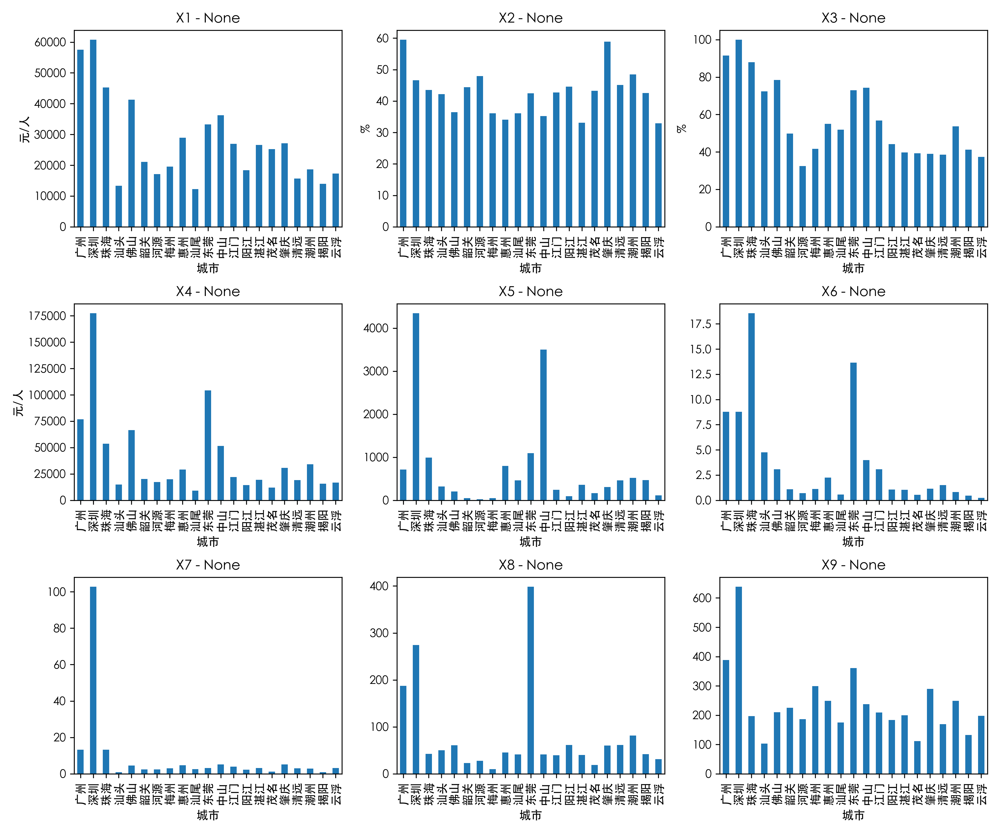

# 多元数据的Python可视化实验报告

## 一、实验目的

本实验旨在通过Python数据分析和可视化工具，对多元统计数据进行深入分析和直观表示。具体来说，我们希望掌握多元数据的直观表示方法，了解多变量图形的一些特点，并学习一些复杂数据的图示技术。通过可视化分析，我们能够快速识别数据中的模式、趋势、异常值和变量间的关系，为后续的统计建模和决策提供依据。同时，本实验也帮助我们熟悉Python数据科学生态系统中常用的库（如pandas、matplotlib等）的使用方法，培养实际数据处理和分析能力。

## 二、实验准备

### 2.1 实验环境

在本实验中，我们使用了Python编程环境，并依赖以下几个重要的库：

- **pandas**: 用于数据处理和分析的强大工具
- **numpy**: 提供高效的数值计算支持
- **matplotlib**: 用于绘制各种统计图表的可视化库

为了支持中文显示，我们特别设置了中文字体：

```python
import pandas as pd
import numpy as np
import matplotlib.pyplot as plt
import os

# 创建结果保存目录
if not os.path.exists('./result'):
    os.makedirs('./result')

# 设置中文字体
plt.rcParams['font.sans-serif'] = ['STHeiti']
```

### 2.2 数据集介绍

本实验主要使用了两个数据集：

1. **全国31个省市居民消费数据**：包含中国31个省级行政区的居民消费情况，涵盖食品、衣着、设备、医疗、交通、教育、居住和杂项8个消费类别。数据来源于《2020中国统计年鉴》，展示了城镇居民家庭平均每人全年消费性支出情况。

2. **城市现代化水平指标数据**：包含21个城市的9个现代化指标，包括：
   - X1: 人均GDP（元/人）
   - X2: 第三产业增加值占GDP比重（%）
   - X3: 城镇人口占常住人口比例（%）
   - X4: 居民人均可支配收入（元）
   - X5: 每十万人拥有医生数
   - X6: 每万人中专业技术人员数
   - X7: 每百人公共图书馆藏书数（册）
   - X8: 人均道路铺装面积（m²/人）
   - X9: 每万人拥有公共汽电车数（辆）

这两个数据集为我们研究区域经济发展、居民生活水平和城市现代化程度提供了丰富的素材。

## 三、实验内容

### 3.1 数据读取与基本统计量计算

首先，我们使用pandas库读取Excel文件中的数据。为了方便后续分析，我们将第一列（地区名）设置为索引：

```python
# 读取Excel数据
pd.set_option('display.max_rows', 8)  # 显示最大行数
d31 = pd.read_excel('mvsData.xlsx', 'd31', index_col=0)
```

读取后，我们检查了数据框的基本信息：

```
数据形状: (31, 8)
列名: ['食品', '衣着', '设备', '医疗', '交通', '教育', '居住', '杂项']
索引: ['北京', '天津', '河北', '山西', '内蒙古', '辽宁', '吉林', '黑龙江', '上海', '江苏', '浙江', '安徽', '福建', '江西', '山东', '河南', '湖北', '湖南', '广东', '广西', '海南', '重庆', '四川', '贵州', '云南', '西藏', '陕西', '甘肃', '青海', '宁夏', '新疆']
```

接下来，我们计算了多元数据的基本统计量，包括均值向量、协方差矩阵和相关系数矩阵：

```python
# 计算均值向量
means = d31.mean()

# 计算协方差矩阵
cov_matrix = d31.cov()

# 计算相关系数矩阵
corr_matrix = d31.corr()
```

通过计算得到的均值向量显示，居民消费支出最高的类别是食品（6021.25元）和居住（5059.96元），其次是交通（2867.72元）和教育（2492.99元）。这表明在日常生活中，食品和住房支出占据了居民消费的主要部分。

协方差矩阵反映了变量间的共变关系，但由于不同变量的单位和数量级不同，解释起来较为困难。相关系数矩阵则进一步将协方差标准化，使得各项系数均在-1到1之间，便于比较不同变量对间的相关强度。

通过相关系数矩阵，我们发现了一些有趣的现象：
- 交通支出与杂项支出的相关性最高，达到0.919
- 交通支出与设备支出也有很强的相关性（0.906）
- 食品与衣着的相关性相对较弱（0.545）

此外，我们还计算了描述性统计量，全面了解各消费类别的分布特征：


### 3.2 单变量分析与可视化

为了直观了解各个地区在单个消费类别上的差异，我们绘制了食品消费的条形图：


从图中可以看出，上海地区的食品消费最高，其次是广东和天津。山西、河南和贵州地区的食品消费相对较低。这种可视化方式使我们能够快速识别出不同地区在食品消费上的差异，反映了地区经济发展的不平衡性。

同样，我们也关注了北京市一个样本的消费结构：


北京市的居住支出远高于其他类别，显示出大城市房价和租金对居民生活成本的显著影响。食品支出排在第二位，交通和教育支出也较为突出。

### 3.3 多变量对比与可视化

为了全面比较不同地区各类消费的差异，我们绘制了包含所有消费类别的条形图：


这种多变量的条形图让我们能够同时比较不同地区在各个消费类别上的差异。为了更清晰地观察每个消费类别的分布，我们还使用了子图的方式：


此外，我们还专门比较了北京、上海和广东三个经济发达地区的消费情况：


从图中可以看出，上海在食品和居住方面的支出明显高于北京和广东，而北京的教育支出则相对较高。这些差异反映了不同地区的经济结构和生活成本的不同特点。

### 3.4 数据分布特征与箱线图

为了更深入了解各消费类别的分布特征，我们使用了箱线图：


箱线图清晰地展示了每个消费类别的中位数、四分位范围和异常值。我们可以观察到：
- 食品消费有较广的分布范围，存在多个高值异常点
- 居住支出显示出最大的变异性，且存在明显的异常值（可能是北京、上海等一线城市）
- 衣着、设备和杂项支出的分布范围相对较窄，变异性较小

水平箱线图提供了另一个角度的观察视角：


### 3.5 变量间关系探索

为了探索不同消费类别之间的关系，我们绘制了散点图。例如，分析食品消费与衣着消费的关系：


计算得到的相关系数为0.5454，说明食品消费与衣着消费之间存在中等程度的正相关关系。这意味着食品消费水平较高的地区，衣着消费也倾向于较高，但这种关系并不十分强烈。

为了全面了解所有变量间的关系，我们还绘制了散点矩阵图：


散点矩阵图的对角线上是各变量的分布直方图，非对角部分是变量两两之间的散点图。通过这种方式，我们能够一次性观察所有变量对之间的关系，发现潜在的模式和相关性。

### 3.6 城市现代化水平分析

接下来，我们使用第二个数据集分析城市现代化水平。首先读取数据并进行基本分析：

```python
case3 = pd.read_excel('mvsCase.xlsx', 'Case3', index_col=0)
```

数据集包含21个城市的9个现代化指标，我们首先查看了基本统计量：

```
数据形状: (21, 9)
列名: ['X1', 'X2', 'X3', 'X4', 'X5', 'X6', 'X7', 'X8', 'X9']
城市: ['广州', '深圳', '珠海', '汕头', '佛山', '韶关', '河源', '梅州', '惠州', '汕尾', '东莞', '中山', '江门', '阳江', '湛江', '茂名', '肇庆', '清远', '潮州', '揭阳', '云浮']
```

通过人均GDP的条形图，我们直观地看到了城市间经济发展水平的差异：


深圳和广州的人均GDP明显高于其他城市，显示出核心城市的经济优势。

为了全面比较城市间的现代化水平，我们使用了堆叠条形图：


这种图表方式让我们能够同时比较多个指标，观察城市间的综合差异。我们还通过子图方式展示了各个指标的分布：



特别地，我们关注了珠三角核心城市（广州、深圳、珠海）的经济指标对比：


数据显示深圳的人均GDP和人均可支配收入均高于广州和珠海：
- 深圳：人均GDP 60801.00元/人，人均可支配收入177506.73元/人
- 广州：人均GDP 57491.00元/人，人均可支配收入76828.83元/人
- 珠海：人均GDP 45284.00元/人，人均可支配收入53668.53元/人

这反映了深圳作为经济特区的强劲发展势头，特别是在居民收入水平方面的显著优势。

我们还分析了城市的产业结构和城镇化率：


深圳的城镇化率达到100%，展现了完全城镇化的特点，而三个城市的第三产业比重都在40%以上，表明服务业在经济结构中的重要地位。

## 四、实验总结

通过本次实验，我们运用Python数据分析和可视化工具，对两个多元数据集进行了全面的分析。我们从数据读取、基本统计量计算开始，通过各种图表方式展示了数据的不同特征和关系。

在省级居民消费数据分析中，我们发现食品和居住是居民消费的主要部分，不同地区的消费水平和结构存在显著差异。北京、上海、广东等经济发达地区的总体消费水平明显高于其他地区，但在具体消费类别上也有各自的特点。通过相关性分析，我们发现不同消费类别之间存在复杂的相互关系，反映了居民消费行为的内在联系。

在城市现代化水平分析中，我们观察到城市发展的不平衡性，核心城市在经济、社会、基础设施等方面具有明显优势。特别是珠三角地区的广州、深圳和珠海，它们的经济发展水平和现代化程度较高，但各自也有不同的发展特点。深圳在人均收入和城镇化率方面表现尤为突出，体现了经济特区的发展成就。

通过多种可视化方法，如条形图、箱线图、散点图、散点矩阵等，我们能够从不同角度观察数据，发现数据中的模式、趋势和特殊现象。这些可视化方法为我们提供了直观理解复杂多元数据的有效工具。

本实验的意义不仅在于掌握了Python数据分析和可视化技术，更在于通过数据分析深入理解了区域经济发展和居民生活水平的现状及差异。这些分析结果可以为政策制定、区域发展规划提供参考依据。未来，我们可以进一步拓展分析方法，如主成分分析、聚类分析等，深入挖掘数据中的潜在价值。

通过本次实验，我深刻体会到数据可视化在多元统计分析中的重要作用。合适的可视化方法能够将复杂的数据关系转化为直观易懂的图形，帮助我们更好地理解数据、发现问题，并为决策提供支持。
