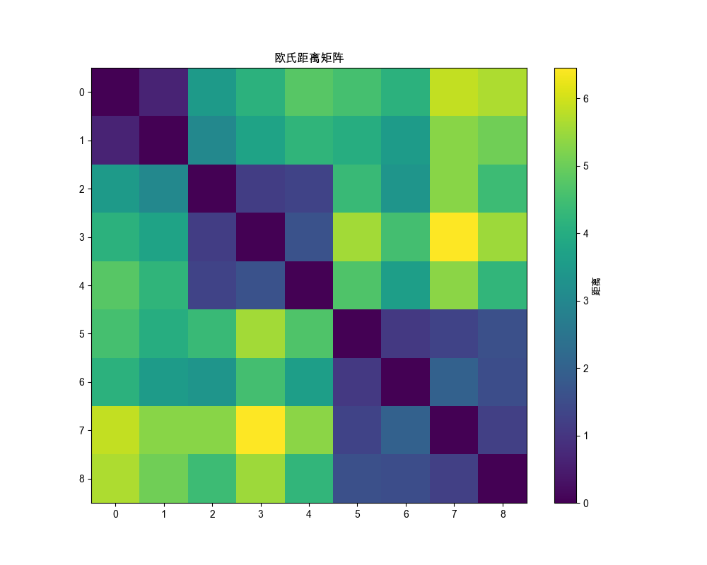
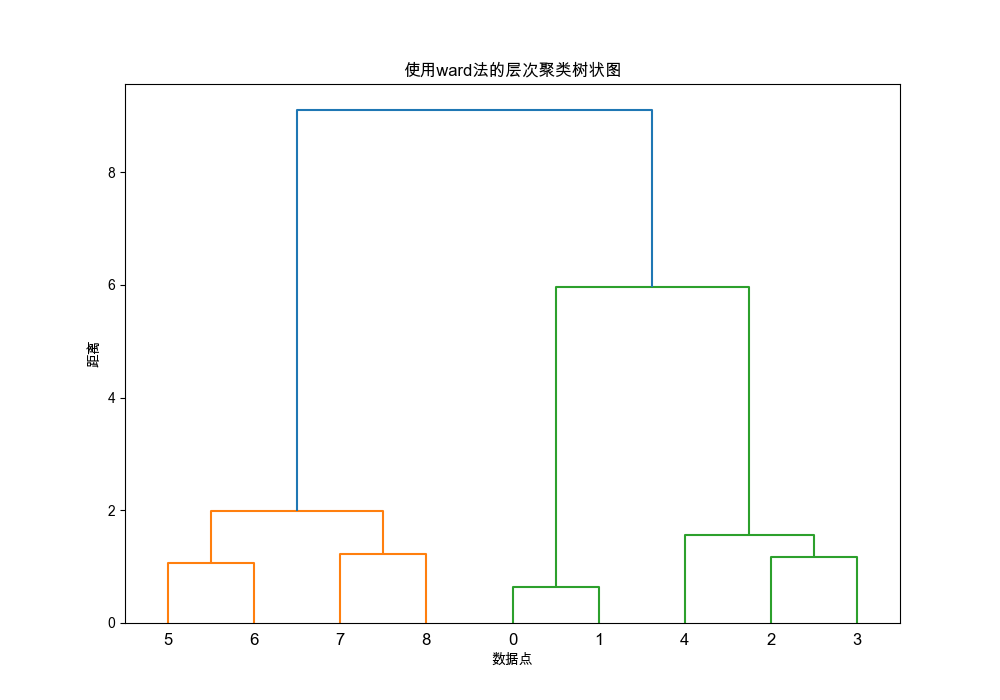
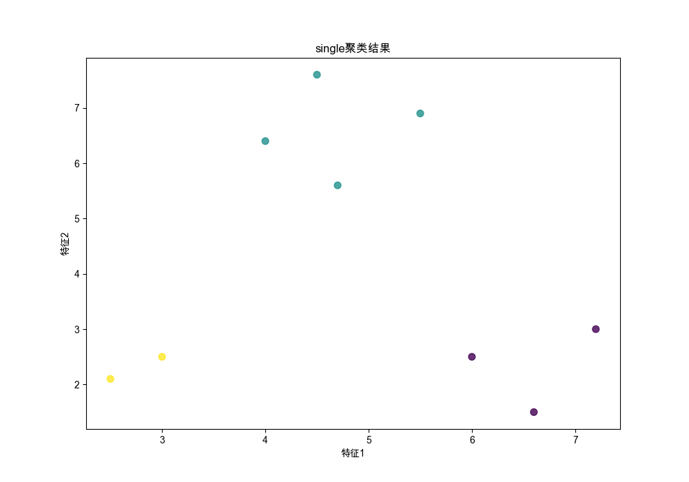
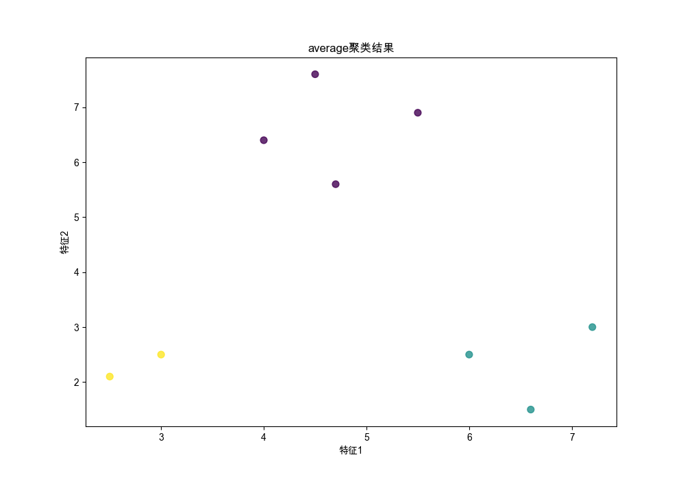
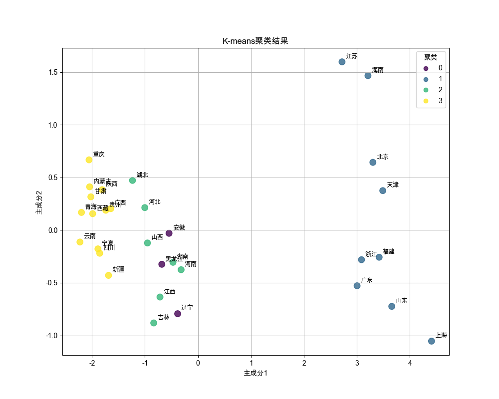
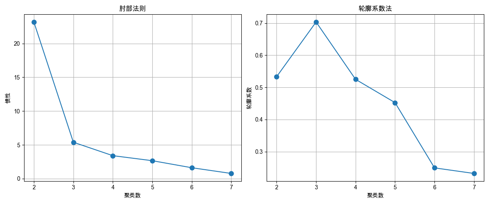
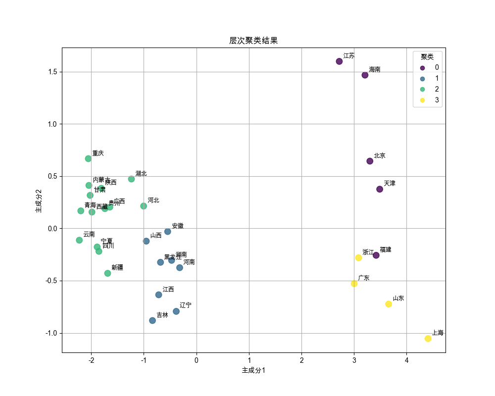

# 多元统计分析与Python聚类方法实验报告

## 一、实验目的

本次实验旨在理解和掌握多元统计分析中的聚类分析方法，包括距离度量、系统聚类法和快速聚类法（K-means）等算法，并通过Python实现这些方法，对实际数据进行聚类分析，以培养数据分析和解释能力。

## 二、实验准备

### 软件环境
- Python 3.8
- 相关库：NumPy, Pandas, Matplotlib, SciPy, Scikit-learn

### 数据准备
- 图例数据点集：9个二维数据点，用于基础聚类演示
- 中国31个省级行政区域经济指标数据：包括GDP、人均GDP、城镇化率、第三产业占比等

## 三、实验内容

### 1. 距离计算与可视化

首先计算了数据点之间的不同距离度量，包括欧氏距离（Euclidean）、曼哈顿距离（Manhattan/Cityblock）、闵可夫斯基距离（Minkowski）和马氏距离（Mahalanobis）。

**欧氏距离矩阵热图：**

距离矩阵的计算结果表明，样本1和样本2距离最近，而样本5和样本8之间的距离相对较远。通过热图可以直观地观察样本间的相似性，为后续的聚类分析奠定基础。

### 2. 系统聚类方法实现

实现了六种系统聚类方法：单连接法（Single）、全连接法（Complete）、平均连接法（Average）、中间连接法（Median）、重心法（Centroid）和Ward法。

**Ward法树状图：**

从Ward法的树状图可以看出，样本大致可以分为三类。第一类包括样本6、7、8、9；第二类包括样本3、4、5；第三类包括样本1、2。这种分类方式与数据点在二维空间的分布特征相符。

**各种系统聚类法结果比较：**

在实验中发现，除单连接法外，其他方法的聚类结果较为一致，都将样本分为相似的三组。这说明在这个数据集上，多种聚类方法都能较好地捕捉数据的自然分组。

### 3. K-means聚类实现

使用K-means算法对数据进行聚类，并通过肘部法则和轮廓系数确定最优聚类数。

**K-means聚类结果：**

K-means聚类得到的结果与系统聚类法类似，也将数据分为三组。从图中可以看出，每个类内部的样本点相互靠近，而类与类之间有明显的分隔，聚类效果较好。

**聚类数评估：**

通过肘部法则和轮廓系数分析，当聚类数为3时，模型表现最佳。肘部法则显示在K=3处有明显的拐点，而轮廓系数也在K=3处接近最高值，这与我们选择的聚类数一致。

### 4. 区域经济发展聚类分析

对中国31个省级行政区域的经济数据进行聚类分析，探索经济发展的区域特征。

**主成分分析结果：**

主成分分析结果显示，前两个主成分共解释了约89.13%的数据方差，其中第一主成分解释了83.20%的方差，第二主成分解释了5.92%的方差。这表明经济指标之间存在较强的相关性，可以通过降维来简化分析。

**K-means聚类结果：**

区域经济聚类结果将31个省级行政区域分为4类：
- 聚类0：辽宁、黑龙江、安徽
- 聚类1：北京、天津、上海、江苏、浙江、福建、山东、广东、海南
- 聚类2：河北、山西、吉林、江西、河南、湖北、湖南
- 聚类3：内蒙古、广西、重庆、四川、贵州、云南、西藏、陕西、甘肃、青海、宁夏、新疆

聚类结果基本符合我国区域经济发展的实际情况，聚类1对应东部沿海发达地区，聚类3对应西部欠发达地区，聚类0和聚类2则分别对应东北和中部地区的不同发展水平。

**层次聚类结果：**

层次聚类的结果与K-means的结果有一定差异，但同样反映了我国区域经济发展的不平衡性。在降维后的二维空间中，经济发展水平相似的省份被聚在一起，形成了较为清晰的空间分布。

## 四、实验总结

本次实验通过Python实现了多种聚类分析方法，对样例数据和实际经济数据进行了分析。实验过程中发现：

1. 不同的距离度量对聚类结果有一定影响，但整体趋势相似。

2. 系统聚类法和K-means算法各有优缺点。系统聚类法不需要预先指定类别数，能形成层次结构，但计算复杂度高；K-means算法计算效率高，但需要提前确定类别数，且对初始中心点敏感。

3. 在区域经济数据分析中，聚类结果基本符合我国区域经济发展的实际情况，验证了聚类分析在经济地理研究中的应用价值。

4. 聚类分析作为一种无监督学习方法，能够发现数据中的自然分组，为进一步的分析提供基础。

通过本次实验，加深了对聚类分析原理的理解，提高了使用Python进行数据分析的能力，对多元统计分析方法在实际问题中的应用有了更深入的认识。