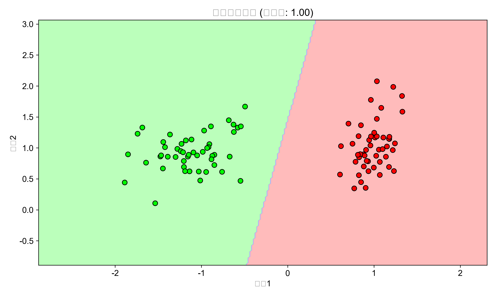

# 多元统计分析实验报告

## 实验目的

本实验旨在通过Python编程实现多元统计分析中的各种判别函数算法，深入理解Fisher判别分析、Bayes判别分析、线性与非线性判别函数以及多总体距离判别等方法的基本原理与应用。通过对不同数据分布特征的样本进行分类与预测，比较各种判别方法的效果，培养多元统计分析的实践能力和数据分析思维。实验还将对线性模型、广义线性模型等统计分析方法进行可视化，以直观展示其工作原理和判别效果。

## 实验准备

实验环境采用Python编程语言及其相关科学计算库。主要用到的工具包括：

numpy用于数值计算与矩阵运算；matplotlib和seaborn用于数据可视化；scikit-learn提供了线性判别分析(LDA)、二次判别分析(QDA)等算法的实现；pandas用于数据处理。此外，实验中还用到了scipy的统计功能，以及sklearn.datasets中的数据生成函数，用于创建具有特定分布特征的模拟数据集。

实验前已搭建好Python环境并安装相关库，创建了result目录用于存储实验结果图表。为确保图表在macOS系统上正常显示，程序中对matplotlib的字体进行了适配设置。

## 实验内容

### 数据分类与模型选择

在多元统计分析中，模型选择是非常重要的一环。实验中分别实现了线性判别分析和二次判别分析两种模型，并对比了它们在分类任务中的表现。通过sklearn的make_classification函数生成了一个二分类数据集，用于测试这两种判别方法。结果显示，两种方法在该数据集上均达到了100%的准确率，说明数据集的类别具有良好的可分性。

线性判别分析方法假设各类别的协方差矩阵相同，因此决策边界是线性的；而二次判别分析方法考虑了不同协方差矩阵，产生曲线决策边界。下图直观展示了线性判别分析的决策边界：

### 方差分析模型

方差分析是统计学中用于比较多个总体均值是否相等的方法。实验中实现了四种方差分析设计：完全随机设计、随机区组设计、析因设计和正交设计。

完全随机设计模型中，生成了三组不同均值的正态分布数据，通过单因素方差分析检验组间差异。F统计量和p值分别用于评估组间差异的显著性。可视化结果显示了三组数据的分布特征：

随机区组设计考虑了区组因素的影响，消除了由此带来的干扰。实验中模拟了4个区组和3个处理水平的数据，并通过模拟计算了F统计量。结果表明，考虑区组因素后，能更准确地评估处理效应：

析因设计用于研究多个因素及其交互作用对响应变量的影响。实验模拟了一个两因素析因设计，分析了因素A和因素B的主效应以及交互效应。下图展示了交互效应图，显示两个因素之间存在一定的交互作用：

正交设计是一种高效的实验设计方法，能够在较少的试验次数内获取较多的信息。实验中使用了L4(2^3)正交表进行设计，并分析了三个因素的主效应：

### 广义线性模型

广义线性模型是线性模型的扩展，能够处理非正态分布的响应变量和非线性关系。实验中重点实现了Logistic模型和对数线性模型。

Logistic模型是处理二分类问题的经典方法。实验使用sklearn的LogisticRegression实现了Logistic回归，并可视化了其决策边界。同时，还绘制了Logistic函数的S形曲线，直观展示了该函数的特性：

对数线性模型适用于响应变量与预测变量之间存在指数关系的情况。通过对响应变量取对数，将非线性关系转化为线性关系进行建模。实验生成了符合指数关系的数据，通过对数转换后进行线性回归，并比较了原始空间和对数空间中的拟合效果：

### Fisher判别分析

Fisher判别分析是一种经典的线性判别方法，其核心思想是寻找一个投影方向，使得投影后类间方差最大化，类内方差最小化。实验使用经典的鸢尾花数据集，通过Fisher线性判别分析进行分类，准确率达到了80%。

下图展示了Fisher判别分析的决策边界和判别方向。判别方向表示了最能区分不同类别的特征组合方向：

### Bayes判别分析

Bayes判别分析基于贝叶斯定理，考虑了先验概率、类条件概率密度和后验概率。实验中生成了两个具有不同协方差矩阵的高斯分布数据，使用二次判别分析（QDA）实现了贝叶斯判别。结果显示，该方法在测试数据上的准确率高达98.5%。

下图展示了贝叶斯判别分析的决策边界和概率密度分布：

### 非线性判别函数

当数据类别无法通过线性边界有效分离时，非线性判别函数显得尤为重要。实验中使用了两个典型的非线性数据集：圆形数据和半月形数据，分别代表了不同类型的非线性分类问题。

通过二次判别分析（QDA）实现了非线性判别，能够有效地捕捉数据的非线性结构。下图展示了QDA在圆形数据上的分类效果：

### 多总体距离判别

多总体距离判别处理涉及三个或更多类别的分类问题。实验使用鸢尾花数据集的三个类别，采用线性判别分析进行多类别分类，准确率为80%。

除了决策边界可视化外，还计算了类别间的马氏距离，并通过混淆矩阵分析了分类错误的模式：

从马氏距离矩阵可以看出，类别1与类别3之间的距离最大（4.66），说明这两个类别最易区分；而类别2与类别3之间的距离最小（1.27），表明这两个类别有一定的重叠，相对较难区分。

### 正态总体判别

正态总体判别假设各类别数据服从多元正态分布，是许多判别方法的基础。实验中生成了三个具有不同均值向量和协方差矩阵的多元正态总体，分别使用LDA和QDA进行判别。

结果显示，QDA的准确率（93.67%）略高于LDA（93.00%），这是因为QDA考虑了不同类别的协方差差异，更适合实验中生成的数据特征。下图展示了正态总体的密度分布和两种方法的决策边界：

## 实验总结

通过本次多元统计分析实验，系统地实现和比较了各种判别函数算法，深入理解了它们的原理和应用场景。实验结果表明，不同的判别方法适用于不同特征的数据分布：对于线性可分的数据，线性判别分析（LDA）简单高效；对于非线性数据或各类别方差不同的情况，二次判别分析（QDA）和非线性判别函数表现更佳。

Fisher判别分析和Bayes判别分析分别从不同的理论基础出发，为分类问题提供了有效的解决方案。特别是Bayes判别分析在考虑先验概率的情况下，能够取得较高的分类准确率。多总体距离判别扩展了二分类问题，通过马氏距离量化了不同类别间的差异，为分类提供了重要参考。

方差分析模型和广义线性模型的实现加深了对统计建模的理解，体会到了不同实验设计和模型选择对分析结果的影响。通过可视化技术，直观展示了各种方法的工作原理和判别效果，有助于更好地理解抽象的统计概念。

总体而言，多元统计分析在数据分类和模式识别中具有重要应用价值。通过合理选择和应用判别函数，能够从多维数据中有效提取信息，为决策提供科学依据。未来可以进一步探索更复杂的判别方法，如支持向量机、神经网络等，以及在真实数据集上的应用效果比较。