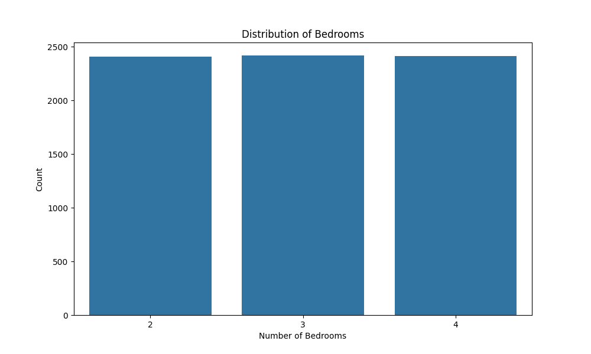
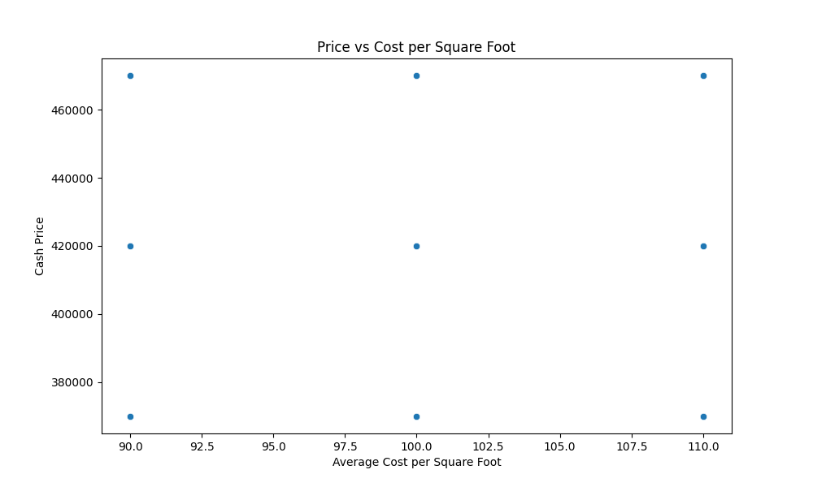
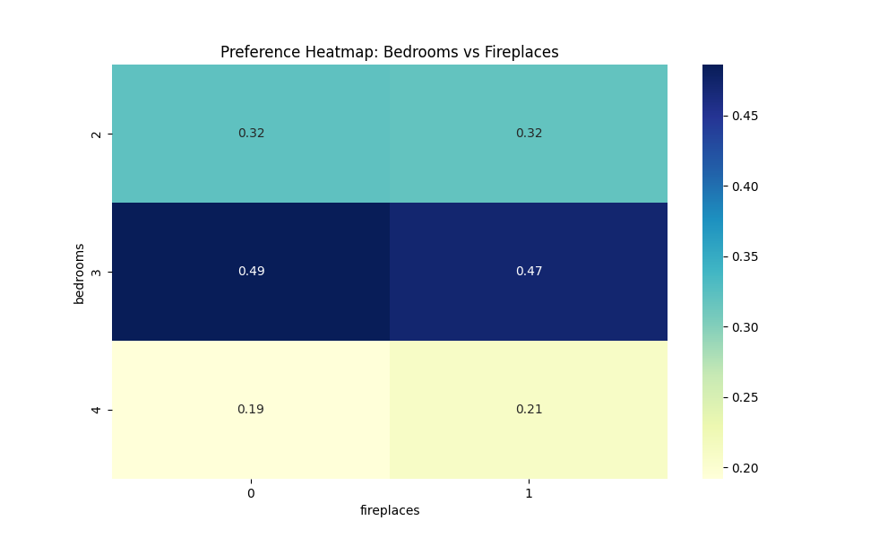

# Sunnyvale Housing Market Analysis Report

## 1. Introduction

This report presents an analysis of the housing market in Sunnyvale, California, based on data from potential homebuyers who are relocating to a high-value neighborhood. The analysis aims to understand buyer preferences, key factors influencing house choices, and predict market shares for different housing options.

## 2. Data Examination and Preprocessing

The dataset contained information on house features such as the number of bedrooms, presence of fireplaces, and pricing details. Initial examination revealed some data quality issues:

- The 'bedrooms' column contained unexpected values (e.g., 'elec', 'gas', 'hyb') in addition to the expected 2, 3, and 4 bedroom options.
- There were numerous missing values in the test dataset.

After preprocessing:
- The 'bedrooms' data was cleaned and converted to numeric values.
- Missing values were filled with the median or mode as appropriate.

## 3. Exploratory Data Analysis

### 3.1 Distribution of Bedrooms

The graph shows the distribution of the number of bedrooms in the houses. The most common number of bedrooms is 3, followed closely by 4 and 2 bedroom options.

### 3.2 Price vs. Cost per Square Foot

This scatter plot illustrates the relationship between the cash price of houses and their average cost per square foot. There appears to be a positive correlation, as expected, with some clustering visible.

### 3.3 Preference Heatmap: Bedrooms vs Fireplaces

This heatmap visualizes the preference patterns based on the number of bedrooms and the presence of fireplaces. Darker colors indicate higher preference.

## 4. Key Insights

1. **Bedroom Preference**: The most popular number of bedrooms is 3.
2. **Average Price**: The average cash price for houses in the dataset is $420,027.61.
3. **Fireplace Prevalence**: 24.84% of the houses in the dataset have fireplaces.

## 5. Factors Influencing House Choice

Based on the multinomial logit model, the following factors were found to be most influential in house choice decisions (in order of importance):

1. House Option C (coefficient: 8.1211)
2. House Option B (coefficient: 8.1163)
3. House Option A (coefficient: 8.0439)
4. Number of Bedrooms (coefficient: -0.2981)
5. Presence of Fireplaces (coefficient: 0.0293)
6. Average Cost per Square Foot (coefficient: -0.0198)
7. Cash Price (coefficient: -1.43e-05)

### Interpretation:

- The specific house options (A, B, C) have the strongest influence on buyer decisions. This suggests that there are significant differences between these options that appeal to buyers.
- Interestingly, the number of bedrooms has a negative coefficient, implying that more bedrooms might decrease the likelihood of choice when other factors are controlled for.
- The presence of a fireplace has a small positive impact on choice.
- Both the average cost per square foot and the cash price have negative impacts on choice, as expected (higher prices decrease likelihood of choice), but their influence is relatively small compared to other factors.

## 6. Predicted Choice Shares

Based on our model, the predicted market shares for the housing options are:

- Option 1: 93.58%
- Option 2: 6.42%

This suggests a strong preference for Option 1 among potential buyers.

## 7. Recommendations

1. **Focus on Quality Over Quantity**: Given the negative coefficient for number of bedrooms, focus marketing efforts on the quality and utility of spaces rather than just the number of rooms.

2. **Highlight Unique Features**: The strong influence of specific house options (A, B, C) suggests that unique features of each option are crucial. Identify and emphasize these distinguishing characteristics in marketing materials.

3. **Emphasize Fireplaces**: Although the effect is small, the presence of a fireplace positively influences choice. Consider highlighting this feature in home listings and advertisements.

4. **Pricing Strategy**: While price is a factor, it's not the most influential. This suggests there might be room for premium pricing if other desirable features are present.

5. **Further Research**: Investigate what specific aspects of Options A, B, and C are most appealing to buyers. This could inform future development and marketing strategies.

6. **Targeted Marketing**: Given the strong preference for Option 1, develop targeted marketing campaigns for this option while also investigating ways to increase the appeal of Option 2.

## 8. Conclusion

The Sunnyvale housing market shows clear preferences among potential buyers, with specific house options being the primary driver of choice. While traditional factors like number of bedrooms and price do play a role, their impact is less straightforward than might be expected. This analysis provides valuable insights for real estate developers, agents, and marketers operating in the Sunnyvale area, offering data-driven guidance for decision-making in this competitive market.