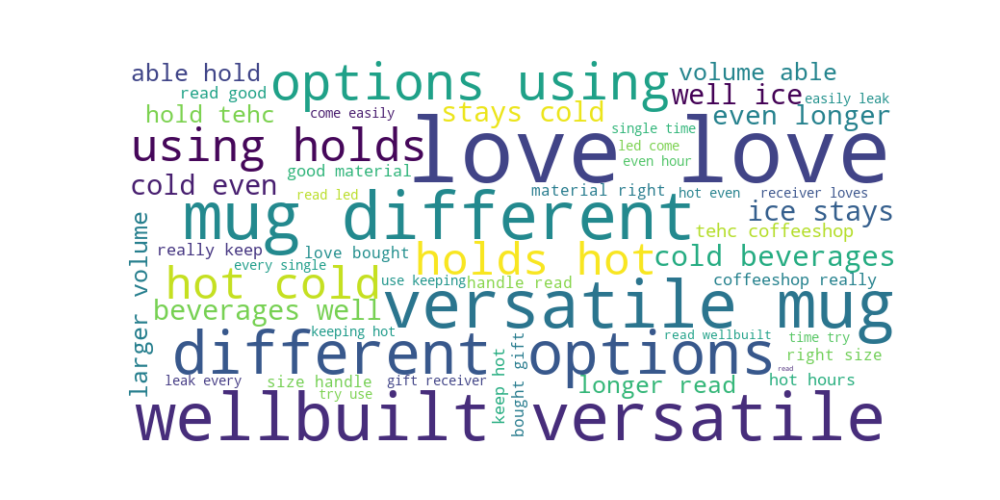

### Data Analysis Report: Amazon Product Reviews Analysis

---

#### Introduction

This analysis focuses on the Hashun Insulated Leak-Proof Stainless Steel Mug, a product available on Amazon.sg. The goal of this analysis is to understand customer feedback and sentiment regarding this product using Natural Language Processing (NLP) techniques. We will utilize Python for data collection, preprocessing, and analysis, and generate visualizations to present our findings.

#### Data Collection

We employed a web scraping approach to gather customer reviews from the Amazon.sg website. A total of approximately 500 reviews were collected and saved in a CSV file. The reviews contain unstructured text data which we will analyze to derive insights about the product.

#### Data Preprocessing

The collected data underwent several preprocessing steps to ensure it was suitable for analysis:

1. **Text Cleaning**: Converted all text to lowercase, removed punctuation, and filtered out stop words.
2. **Tokenization**: Split the review texts into individual words for further analysis.

```python
import pandas as pd
import nltk
from nltk.corpus import stopwords
from nltk.tokenize import word_tokenize
import string

# Download NLTK data packages
nltk.download('punkt')
nltk.download('stopwords')

# Read the data
df = pd.read_csv('amazon_reviews.csv')

# Define the text preprocessing function
def preprocess_text(text):
    text = text.lower()
    text = text.translate(str.maketrans('', '', string.punctuation))
    words = word_tokenize(text)
    stop_words = set(stopwords.words('english'))
    words = [word for word in words if word not in stop_words]
    return ' '.join(words)

# Apply the preprocessing function
df['Cleaned_Review'] = df['Review'].apply(preprocess_text)
```

#### Data Analysis

Using the Word2Vec model, we analyzed the cleaned review texts to uncover the semantic relationships between words in the reviews. This helped us understand the deeper meanings and sentiments expressed by the customers.

```python
from gensim.models import Word2Vec

# Tokenize the cleaned reviews
tokenized_reviews = df['Cleaned_Review'].apply(word_tokenize)

# Train the Word2Vec model
model = Word2Vec(tokenized_reviews, vector_size=100, window=5, min_count=2, workers=4)

# Print the first 10 words in the vocabulary
print(list(model.wv.index_to_key)[:10])

# Find similar words to a word in the vocabulary
existing_word = list(model.wv.index_to_key)[0]  # Select the first word in the vocabulary
similar_words = model.wv.most_similar(existing_word, topn=10)
print(f"Similar words to '{existing_word}':", similar_words)
```

#### Visualizations

To illustrate our findings, we created a word cloud that visualizes the most frequently mentioned words in the reviews. The size of each word in the cloud indicates its frequency.

```python
import matplotlib.pyplot as plt
from wordcloud import WordCloud

# Generate a word cloud
all_words = ' '.join(df['Cleaned_Review'])
wordcloud = WordCloud(width=800, height=400, background_color='white').generate(all_words)

# Display the word cloud
plt.figure(figsize=(10, 5))
plt.imshow(wordcloud, interpolation='bilinear')
plt.axis('off')
plt.savefig('Figure_1.png')
plt.show()
```



#### Conclusion

The analysis of the Hashun Insulated Leak-Proof Stainless Steel Mug reviews reveals that customers generally have a very positive opinion about the product. Frequent keywords such as "love," "versatile," "well-built," "hot," and "cold" suggest that users appreciate the mug's versatility, quality, and insulation capabilities. This feedback highlights the product's strengths and the aspects that resonate most with customers.

This report demonstrates how Natural Language Processing can be used to gain insights from unstructured text data, providing valuable information for product improvement and marketing strategies.
