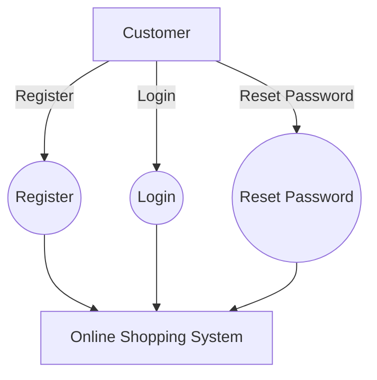
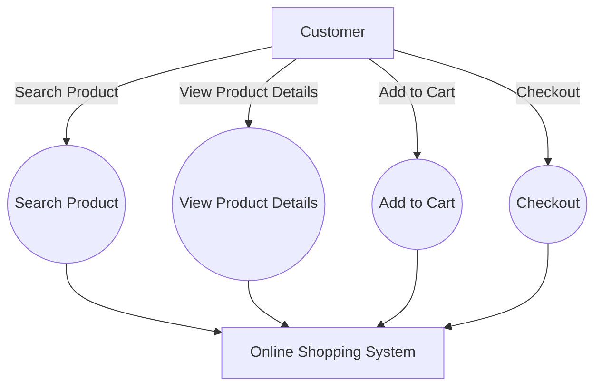

# Online Shopping Use Case Models

## Use Case Diagram 1: Customer Registration and Login

### Use Case Narrative: Register

- **Actor**: Customer
- **Description**: This use case describes the process of a new customer registering an account on the online shopping platform.
- **Preconditions**: The customer has internet access and is on the registration page.
- **Main Flow**:
  1. Customer enters personal information (name, email, password).
  2. System validates the information.
  3. System creates a new account.
  4. System sends a confirmation email.
  5. Customer verifies the email address.
- **Alternate Flow**:
  - If the email is already registered, the system notifies the customer and suggests logging in or resetting the password.
- **Postconditions**: The customer has a new account and can log in to the system.

### Use Case Narrative: Login

- **Actor**: Customer
- **Description**: This use case describes the process of a registered customer logging into their account.
- **Preconditions**: The customer has a registered account.
- **Main Flow**:
  1. Customer enters email and password.
  2. System verifies the credentials.
  3. System grants access to the customer's account.
- **Alternate Flow**:
  - If the credentials are incorrect, the system notifies the customer and allows them to try again or reset their password.
- **Postconditions**: The customer is logged into their account and can access personalized features.

## Use Case Diagram 2: Product Search and Purchase

### Use Case Narrative: Search Product

- **Actor**: Customer
- **Description**: This use case describes the process of a customer searching for a product on the online shopping platform.
- **Preconditions**: The customer is on the platform's homepage or search page.
- **Main Flow**:
  1. Customer enters search keywords in the search bar.
  2. System processes the search query.
  3. System displays a list of relevant products.
  4. Customer can apply filters or sort results.
- **Alternate Flow**:
  - If no results are found, the system suggests alternative keywords or categories.
- **Postconditions**: The customer sees a list of products matching their search criteria.

### Use Case Narrative: Checkout

- **Actor**: Customer
- **Description**: This use case describes the process of a customer completing their purchase.
- **Preconditions**: The customer has items in their shopping cart and is logged in.
- **Main Flow**:
  1. Customer initiates the checkout process.
  2. System displays order summary.
  3. Customer selects shipping method.
  4. Customer enters or selects shipping address.
  5. Customer selects payment method and enters payment details.
  6. System processes the payment.
  7. System confirms the order and provides an order number.
- **Alternate Flow**:
  - If the payment fails, the system notifies the customer and allows them to try again or choose a different payment method.
- **Postconditions**: The order is placed, and the customer receives an order confirmation.