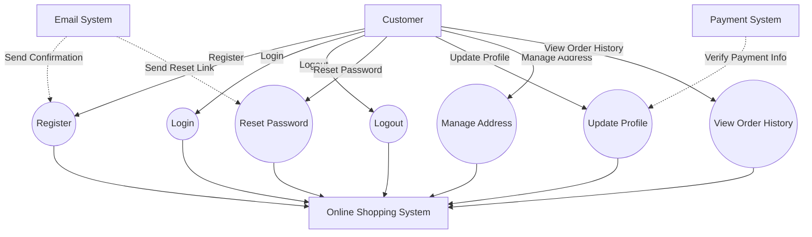
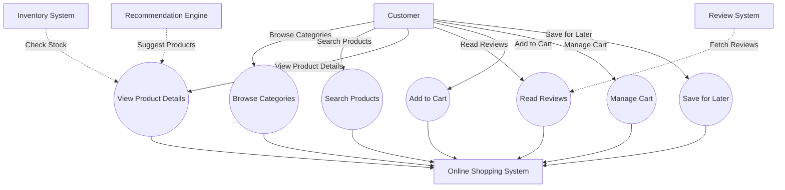

# Detailed Online Shopping Use Case Models

## Use Case Diagram 1: Customer Account Management and Authentication

### Use Case Narrative: Register

- **Actor**: Customer
- **Description**: This use case describes the detailed process of a new customer registering an account on the online shopping platform.
- **Preconditions**: 
  - The customer has internet access.
  - The customer is on the registration page.
- **Main Flow**:
  1. Customer clicks on "Create Account" button.
  2. System displays registration form.
  3. Customer enters required personal information:
     - First Name
     - Last Name
     - Email Address
     - Password (with confirmation)
     - Phone Number
  4. Customer optionally enters additional information:
     - Date of Birth
     - Gender
  5. Customer agrees to Terms of Service and Privacy Policy.
  6. Customer clicks "Submit" button.
  7. System validates all entered information:
     - Checks for completeness
     - Verifies email format
     - Ensures password meets complexity requirements
  8. System checks if email is already registered.
  9. System creates a new account and stores information securely.
  10. System generates a unique customer ID.
  11. System sends a confirmation email with activation link.
  12. Customer receives email and clicks on activation link.
  13. System activates the account.
  14. System redirects customer to login page.
- **Alternate Flows**:
  - 4a. If email is already registered:
    1. System notifies the customer.
    2. System suggests logging in or resetting password.
    3. Use case ends.
  - 7a. If information validation fails:
    1. System highlights invalid fields.
    2. System provides specific error messages.
    3. Customer corrects information.
    4. Use case continues from step 6.
  - 11a. If email is not received:
    1. Customer requests resend of activation email.
    2. System resends activation email.
    3. Use case continues from step 11.
- **Postconditions**: 
  - The customer has a new, activated account.
  - Customer can log in to the system.
  - Customer profile is created in the database.

### Use Case Narrative: Login

- **Actor**: Customer
- **Description**: This use case describes the detailed process of a registered customer logging into their account.
- **Preconditions**: 
  - The customer has a registered and activated account.
  - The customer is on the login page.
- **Main Flow**:
  1. Customer enters email address.
  2. Customer enters password.
  3. Customer clicks "Login" button.
  4. System encrypts entered password.
  5. System compares encrypted password with stored encrypted password.
  6. System verifies account status (active/inactive).
  7. System grants access to the customer's account.
  8. System creates a new session for the customer.
  9. System logs login activity (timestamp, IP address).
  10. System redirects customer to their account dashboard.
- **Alternate Flows**:
  - 5a. If credentials are incorrect:
    1. System increments failed login attempt counter.
    2. System displays "Invalid email or password" message.
    3. Customer can retry or choose "Forgot Password".
    4. If failed attempts exceed threshold, temporary account lock is initiated.
  - 6a. If account is inactive:
    1. System prompts customer to activate account.
    2. System offers to resend activation email.
    3. Use case ends.
  - 7a. If customer enables two-factor authentication:
    1. System sends verification code to customer's registered phone or email.
    2. Customer enters verification code.
    3. System verifies the code.
    4. If correct, use case continues from step 7.
    5. If incorrect, customer can request new code or try again.
- **Postconditions**: 
  - Customer is logged into their account.
  - A new session is created for the customer.
  - Customer can access personalized features and secure areas of the website.

## Use Case Diagram 2: Product Browsing and Shopping Cart Management

### Use Case Narrative: Search Products

- **Actor**: Customer
- **Description**: This use case describes the detailed process of a customer searching for products on the online shopping platform.
- **Preconditions**: 
  - The customer is on any page with a search function.
  - The product database is up-to-date.
- **Main Flow**:
  1. Customer clicks on the search bar.
  2. Customer enters search keywords or phrases.
  3. Customer optionally selects search category from a dropdown.
  4. Customer presses Enter or clicks the search icon.
  5. System processes the search query:
     - Analyzes keywords
     - Applies any category filters
     - Checks for common misspellings
  6. System queries the product database.
  7. System retrieves matching products.
  8. System ranks results based on relevance:
     - Keyword match
     - Product popularity
     - Customer ratings
  9. System displays search results page with:
     - List of matching products
     - Product thumbnails
     - Brief descriptions
     - Prices
     - Average ratings
  10. System shows total number of results found.
  11. System provides filtering options:
      - Price range
      - Brand
      - Customer rating
      - Shipping options
  12. System provides sorting options:
      - Relevance
      - Price (low to high / high to low)
      - Customer rating
      - Newest arrivals
  13. Customer can scroll through results or go to next page.
- **Alternate Flows**:
  - 6a. If no exact matches are found:
    1. System suggests alternative spellings.
    2. System shows related categories.
    3. System displays "no exact matches" message with closest alternatives.
  - 9a. If too many results:
    1. System paginates results.
    2. System suggests using more specific search terms or filters.
  - 11a. Customer applies filters:
    1. System updates results in real-time.
    2. Customer can remove filters individually or clear all.
  - 12a. Customer changes sort order:
    1. System re-orders results according to selected criteria.
- **Postconditions**: 
  - Customer sees a list of products matching their search criteria.
  - Customer can interact with search results (view details, add to cart, etc.).
  - Search query and results are logged for improving future searches.

### Use Case Narrative: Manage Cart

- **Actor**: Customer
- **Description**: This use case describes the process of a customer managing their shopping cart.
- **Preconditions**: 
  - Customer has added at least one item to their cart.
  - Customer is viewing their shopping cart page.
- **Main Flow**:
  1. System displays current cart contents:
     - Product names
     - Quantities
     - Individual prices
     - Subtotal for each item
  2. System shows cart summary:
     - Total number of items
     - Subtotal of all items
     - Estimated tax
     - Estimated shipping cost
     - Total price
  3. For each item, customer can:
     - Adjust quantity
     - Remove item
     - Save for later
  4. Customer adjusts item quantity:
     - Enters new quantity or uses +/- buttons
     - System updates quantity
     - System recalculates item subtotal and cart total
     - System checks inventory availability
  5. Customer removes an item:
     - Clicks "Remove" button
     - System asks for confirmation
     - System removes item from cart
     - System recalculates cart total
  6. Customer moves item to "Save for Later":
     - Clicks "Save for Later" button
     - System moves item to separate "Saved Items" list
     - System recalculates cart total
  7. System continuously updates cart summary as changes are made.
  8. Customer can enter promo code:
     - Enters code in designated field
     - System validates code
     - If valid, system applies discount and updates total
  9. Customer can estimate shipping:
     - Enters zip code
     - System calculates estimated shipping cost
     - System updates cart total
  10. Customer can proceed to checkout or continue shopping.
- **Alternate Flows**:
  - 4a. If adjusted quantity exceeds available inventory:
    1. System displays maximum available quantity.
    2. System updates quantity to maximum available.
    3. System notifies customer of the limitation.
  - 8a. If promo code is invalid:
    1. System displays error message.
    2. Customer can try a different code or proceed without discount.
  - 9a. If shipping to entered zip code is not available:
    1. System notifies customer of shipping restrictions.
    2. System suggests alternative shipping methods if available.
- **Postconditions**: 
  - Shopping cart reflects all customer modifications.
  - Cart totals are accurate based on current contents and any applied discounts.
  - Customer is ready to proceed to checkout or continue shopping.